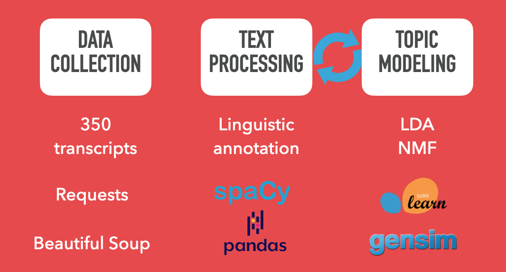
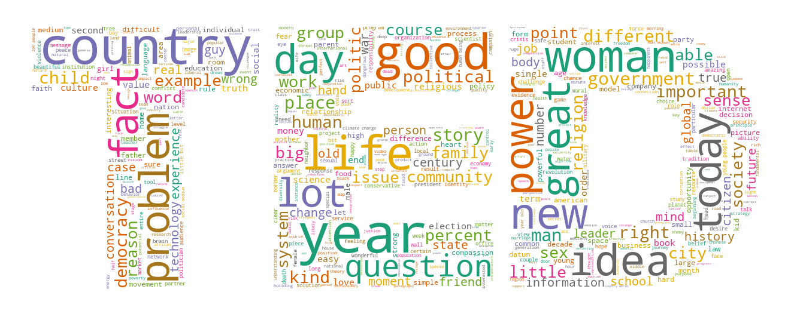
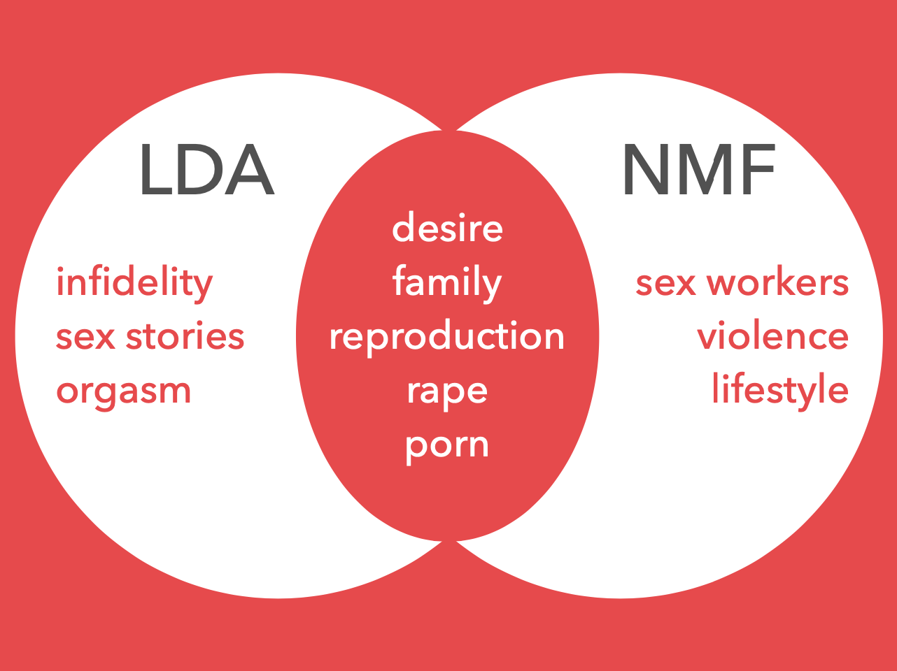

# TED Talks
## Problem Statement
Sex, politics, and religion are three of the main taboo topics that we rarely discuss. Yet, they are very important concepts.

So, why "can't" we talk about them?

A few reasons...  
  * Politics & Religion – People tend to have passionate beliefs which can lead to strong disagreements and emotionally charged discussions.  
  * Sex – Can lead to potential legal implications depending on the context.

Since we rarely talk about these topics, I built a topic model to see what TED speakers had to say about them and better understand the ideas and issues being discussed.

## Workflow

## Word Clouds
Adjectives and Verbs

## Comparing Topic Models – Talks About 'Sex'
LDA – Latent Derelicht Analysis  
NMF – Non-negative Matrix Factorization  

